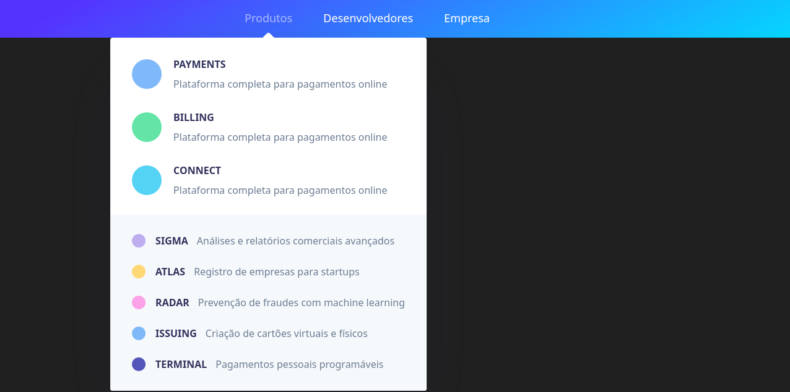
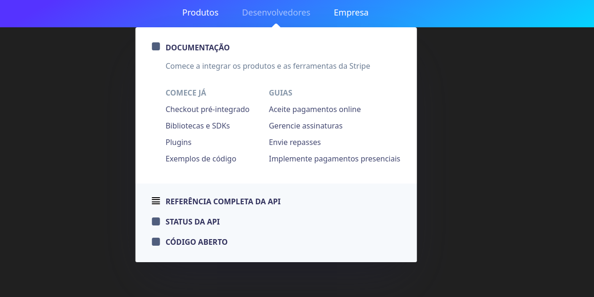
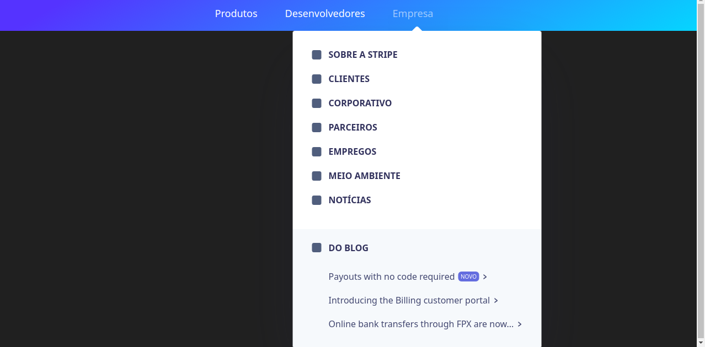

# Aplicação:

<a href="https://jessica-stripe.netlify.app/" target="_blank" >Clique aqui para abrir a aplicação do Stripe</a>

 

# Stripe Clone

Para rodar a aplicação:

`yarn start`

### Criando o projeto

Projeto será criado com java:
- `npx create-react-app nomedoprojeto`

Na pasta src, deixar apenas:

- App.js e index.js

### Instalando bibliotecas

#### Framer Motion

Biblioteca de animações

- `yarn add framer-motion`

#### Styled Components

Biblioteca que permite que o ccs seja aplicado no js

- `yarn add styled-components`

### Configurando aplicação:

Nessa aplicação os arquivos vão ser .js pois estamos utilizando somente o javascript 

Para criar o arquivo dos estilos globais:

- src>styles>GlobalStyles.js

Dentro do arquivo GlobalStyles:

- a exportação deverá ser default

- este arquivo é o mais indicado para ajustar o root

